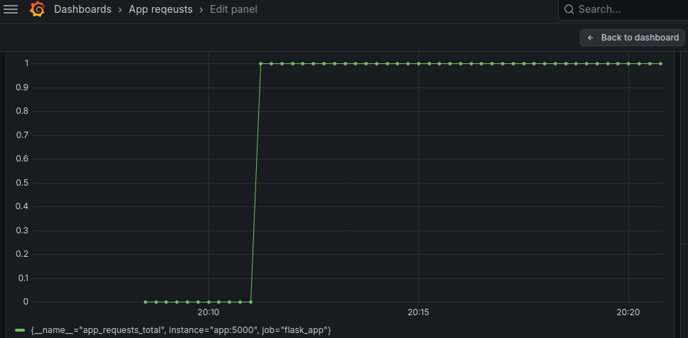

# Prometheus + Grafana Monitoring Stack (Docker Compose)


## Overview

This project demonstrates a simple infrastructure monitoring stack built using **Docker Compose**, **Prometheus**, and **Grafana**.  
It simulates how modern infrastructure environments collect metrics from services and visualize them through dashboards.

The goal of this project was to gain hands-on experience with **observability tooling, containerized infrastructure, and monitoring pipelines** commonly used in DevOps, SRE, and infrastructure engineering environments.

The stack includes:

- A containerized **Python Flask application**
- **Prometheus** for metrics collection
- **Grafana** for metrics visualization
- **Docker Compose** for infrastructure orchestration

---

## Architecture

```
           +---------------------+
           |   Developer Push    |
           +----------+----------+
                      |
                      v
           +---------------------+
           |   GitHub Repository |
           +----------+----------+
                      |
                      v
           +---------------------+
           |  Docker Compose     |
           |  Infrastructure     |
           +----------+----------+
                      |
          +-----------+------------+
          |                        |
          v                        v
+------------------+      +------------------+
|  Flask Web App   | ---> |    Prometheus    |
|  Metrics Export  |      |  Metrics Scraper |
+------------------+      +--------+---------+
                                   |
                                   v
                           +----------------+
                           |     Grafana    |
                           |  Dashboards    |
                           +----------------+
```
Prometheus scrapes metrics exposed by the Flask application and stores them as time-series data. Grafana connects to Prometheus as a data source to visualize the collected metrics.

---

## Project Structure

```
prometheus-grafana-monitoring-demo
│
├── docker-compose.yml
│
├── app
│   ├── app.py
│   ├── Dockerfile
│   └── requirements.txt
│
├── prometheus
│   └── prometheus.yml
│
└── screenshots
    └── grafana-dashboard.png
```
- **app/** – Simple Flask application exposing metrics  
- **prometheus/** – Prometheus scrape configuration  
- **docker-compose.yml** – Infrastructure orchestration  
- **screenshots/** – Dashboard images for documentation

---
## Running the Monitoring Stack

### Clone the Repository

```bash
git clone https://github.com/adrianisinta/prometheus-grafana-monitoring-demo.git
cd prometheus-grafana-monitoring-demo
```
Start the Stack
```
docker compose up --build
```
Access the Services

Flask App

```
http://localhost:5000
```

Prometheus

```
http://localhost:9090
```

Grafana

```
http://localhost:3000
```

Default Grafana login:

```
username: admin
password: admin
```
---

## Grafana Dashboard

Below is an example of the Grafana dashboard visualizing metrics collected by Prometheus.


---

## Observability Concepts Demonstrated

This project demonstrates several key observability concepts used in production infrastructure environments:

- **Metrics Collection** – Prometheus scrapes application metrics
- **Service Monitoring** – Flask application exposes metrics endpoints
- **Visualization** – Grafana dashboards visualize time-series metrics
- **Infrastructure as Code** – Docker Compose defines the monitoring stack
- **Containerized Services** – Each component runs in isolated containers

---
## Learning Objectives

This project helped develop familiarity with:

- Monitoring and observability tooling
- Prometheus metrics collection
- Grafana dashboards and visualization
- Containerized infrastructure using Docker
- Infrastructure orchestration with Docker Compose

---
## Future Improvements

Possible enhancements include:

- Add **Prometheus exporters** for system metrics
- Implement **alerting rules** in Prometheus
- Add **Grafana alerting dashboards**
- Deploy stack to a **cloud environment**
- Integrate **container security scanning**

---
## Author

**Adrian Isinta**

Cybersecurity & Infrastructure Enthusiast

Interests:
- Infrastructure Security
- DevSecOps
- Cloud Security
- Offensive Security
